# 🚀 Terraform-based Render.io Deployment Guide

This guide shows you how to deploy your Job Application Assistant to Render.io using **Terraform for Infrastructure as Code** with a CD pipeline that lets you **visualize changes before applying** them.

## ✨ What This Deploys

Your application will be deployed as 4 services on Render.io using Terraform:

1. **🗄️ PostgreSQL Database** - Stores job applications and user data
2. **🔧 Backend API** - NestJS API server with health checks
3. **🎨 Frontend** - Next.js web application  
4. **⚙️ Temporal Worker** - Background job processing

## 🏗️ Infrastructure as Code Benefits

- **📋 Plan Visualization**: See exactly what will change before applying
- **🔄 Version Control**: All infrastructure changes are tracked in Git
- **🛡️ Approval Process**: Manual approval required for production deployments
- **📊 State Management**: Terraform Cloud manages state (**no AWS or S3 required**)
- **🔁 Reproducible**: Infrastructure can be recreated identically
- **🚀 Simplified Setup**: No need for AWS accounts, S3 buckets, or DynamoDB tables

## 📋 Prerequisites

### 1. Create Terraform Cloud Account

1. Go to [Terraform Cloud](https://cloud.hashicorp.com/products/terraform)
2. Create a free account
3. Create an organization (e.g., "rsa-task")
4. Create a workspace named "job-assistant-production"
5. Generate an API token: Settings → API Tokens → Create API Token

### 2. Get Required API Keys

| Service | How to Get |
|---------|------------|
| **Render API Key** | [Render Account Settings](https://dashboard.render.com/account) → Create API Key |
| **Gemini API Key** | [Google AI Studio](https://makersuite.google.com/app/apikey) → Create API Key |
| **Temporal Address** | Your Temporal cluster endpoint (or use `localhost:7233` for testing) |

### 3. Update Terraform Configuration

Edit `infrastructure/main.tf` line 16:
```hcl
cloud {
  organization = "your-org-name"  # ← Change this to your Terraform Cloud org
  workspaces {
    name = "job-assistant-production"
  }
}
```

### 4. Add GitHub Secrets

Go to your GitHub repository → Settings → Secrets and variables → Actions:

```
TF_API_TOKEN=tfc_xxxxxxxxxxxxx          # Terraform Cloud API token
RENDER_API_KEY=rnd_xxxxxxxxxxxxx        # Render.io API key
GEMINI_API_KEY=AIzaxxxxxxxxxxxxxxxxx    # Google Gemini API key
TEMPORAL_ADDRESS=your-temporal-endpoint:7233  # Temporal server
```

**Note:** No AWS credentials needed! Terraform Cloud handles all state management automatically.

## 🚀 Deployment Process

### Option 1: Automatic CD Pipeline (Recommended)

1. **Push to main branch**:
   ```bash
   git add .
   git commit -m "Deploy to production"
   git push origin main
   ```

2. **View the pipeline**:
   - GitHub Actions will run 3 jobs sequentially:
     - ✅ **Test**: Run tests and linting
     - 📋 **Plan**: Show infrastructure changes (no approval needed)
     - 🚀 **Deploy**: Apply changes (requires manual approval)

3. **Review the plan**:
   - Check the "Plan Infrastructure Changes" job
   - Review the Terraform plan summary in the job output
   - See exactly what resources will be created/modified/destroyed

4. **Approve deployment**:
   - Go to the "Deploy Infrastructure" job
   - Click "Review deployments" 
   - Click "Approve and deploy" to proceed

5. **Monitor deployment**:
   - Watch the apply process in real-time
   - Health checks will verify services are running
   - Get service URLs in the deployment summary

### Option 2: Manual Local Deployment

```bash
# 1. Set environment variables
export TF_VAR_render_api_key="rnd_xxxxxxxxxxxxx"
export TF_VAR_gemini_api_key="AIzaxxxxxxxxxxxxxxxxx"
export TF_VAR_temporal_address="your-temporal-endpoint:7233"

# 2. Navigate to infrastructure directory
cd infrastructure

# 3. Initialize Terraform (one-time setup)
terraform init

# 4. Plan changes (review what will happen)
terraform plan

# 5. Apply changes (only if plan looks good)
terraform apply

# 6. Get service URLs
terraform output
```

### Option 3: Manual GitHub Trigger

Go to GitHub Actions → "Deploy to Render.io with Terraform" → "Run workflow"

## 📊 Deployment Workflow

```mermaid
graph TD
    A[Push to main] --> B[🧪 Run Tests]
    B --> C[📋 Terraform Plan]
    C --> D{Review Plan}
    D -->|Looks good| E[👤 Manual Approval]
    D -->|Issues found| F[🛑 Fix & Retry]
    E --> G[🚀 Terraform Apply]
    G --> H[🩺 Health Checks]
    H --> I[✅ Deployment Complete]
```



## 💰 Cost Estimation

Using **Starter** plans for all services:

- Database (PostgreSQL): ~$7/month
- Backend (Web Service): ~$7/month  
- Frontend (Web Service): ~$7/month
- Worker (Background Worker): ~$7/month

**Total: ~$28/month** (Terraform Cloud free tier included)

## 🛠️ Configuration Management

### Service Plans

Edit `infrastructure/terraform.tfvars` to change resource allocations:

```hcl
# Start with cost-effective plans
backend_plan  = "starter"    # or "standard", "pro", "pro-plus"
frontend_plan = "starter"
worker_plan   = "starter"
database_plan = "starter"

# Scale instances as needed
backend_instances  = 1       # Increase for high availability
frontend_instances = 1
worker_instances   = 1

# Enable production features
enable_high_availability = false  # Set to true for production
enable_monitoring        = true
```

### Scaling for Production

To upgrade for production workloads:

```hcl
# High-performance production setup
backend_plan  = "pro"
frontend_plan = "pro"
worker_plan   = "pro"
database_plan = "pro"

backend_instances  = 2       # High availability
frontend_instances = 2
worker_instances   = 2

enable_high_availability = true
```

## 🔍 Monitoring & Troubleshooting

### View Infrastructure State
```bash
cd infrastructure
terraform show          # View current state
terraform plan          # See pending changes
terraform output        # Get service URLs
```

### Common Issues

1. **Plan Fails**:
   - Check API keys are set correctly
   - Verify Terraform Cloud workspace exists
   - Ensure you have permissions

2. **Apply Fails**:
   - Check Render.io service limits
   - Verify GitHub repository URL is correct
   - Check service names aren't already taken

3. **Services Won't Start**:
   - Check build logs in Render dashboard
   - Verify environment variables
   - Ensure database is ready before app starts

### Rollback Procedure

If deployment fails:

```bash
# Option 1: Revert Git changes
git revert <commit-hash>
git push origin main

# Option 2: Terraform rollback
cd infrastructure
terraform plan    # Plan the rollback
terraform apply   # Apply previous state
```

## 🎯 Next Steps

After successful deployment:

1. **Monitor Services**: https://dashboard.render.com
2. **Set Custom Domains**: Add your domains in Render dashboard
3. **Configure Alerts**: Set up monitoring and notifications
4. **Scale Resources**: Upgrade plans as usage grows
5. **Backup Strategy**: Configure database backups

## 🆘 Support

- **Terraform Cloud**: [Terraform Cloud Docs](https://developer.hashicorp.com/terraform/cloud-docs)
- **Render.io**: [Render Documentation](https://render.com/docs)
- **GitHub Actions**: [Actions Documentation](https://docs.github.com/en/actions)

---

**🎉 That's it!** Your Job Application Assistant is now deployed using modern Infrastructure as Code practices with full visibility into changes before they're applied. 