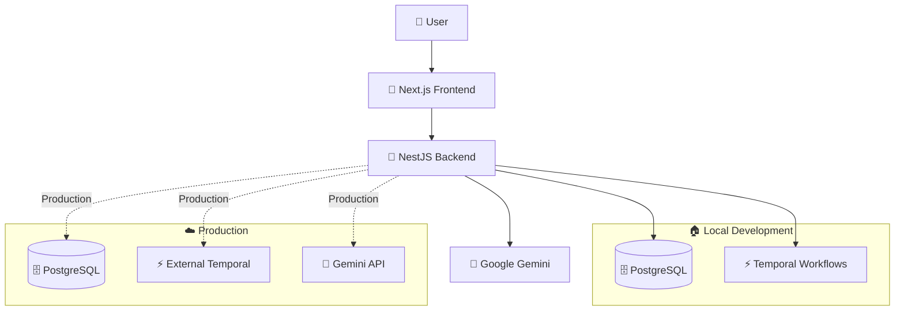
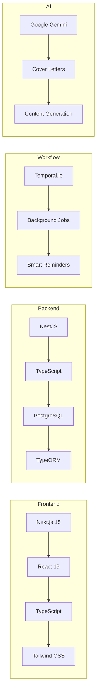
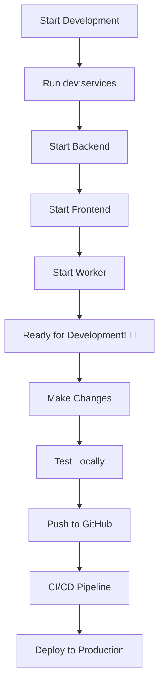
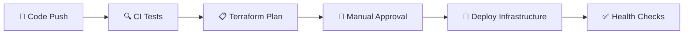
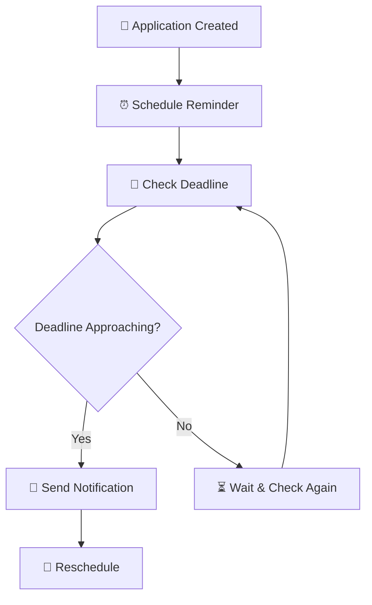

# Job Application Assistant

> A modern, AI-powered job application tracking system with automated workflows and intelligent reminders.

## 🚀 Quick Start

```bash
# 1. Clone and install
git clone <repository-url>
cd rsa-task
pnpm install

# 2. Start infrastructure
pnpm run dev:services

# 3. Setup database
pnpm run migration:run

# 4. Start development
pnpm run start
```

**Access your application:**

- 🌐 Frontend: http://localhost:3000
- 🔧 Backend API: http://localhost:3001
- 📊 Temporal UI: http://localhost:8080
- 📋 API Docs: http://localhost:3001/api/docs (powered by Swagger)
- 📋 API Docs: http://localhost:3001/api/playground (powered by Scalar)

## 🏗️ Architecture



## ✨ Features

| Feature                     | Description                                               |
| --------------------------- | --------------------------------------------------------- |
| 📝 **Application Tracking** | Add, edit, and track job applications with status updates |
| 🤖 **AI Cover Letters**     | Generate personalized cover letters using Google Gemini   |
| ⏰ **Smart Reminders**      | Automated deadline tracking and notifications             |
| 📊 **Analytics Dashboard**  | Visual insights into your application pipeline            |
| 📱 **Mobile-First Design**  | Responsive UI that works on all devices                   |
| 🔄 **Real-time Updates**    | Live application status synchronization                   |

## 🛠️ Tech Stack



## 📁 Project Structure

```
rsa-task/
├── 🎨 frontend/          # Next.js web application
├── 🔧 backend/           # NestJS API server
├── ⚡ temporal/          # Local Temporal configuration
├── 🏗️ infrastructure/    # Terraform deployment configs
├── 📚 docs/             # Detailed documentation
└── 🔧 scripts/          # Automation scripts
```

## 🚀 Development Workflow



## 💻 Local Development

### Prerequisites

- Node.js 18+
- pnpm 8+
- Docker & Docker Compose

### Environment Setup

Create `backend/.env`:

```env
DATABASE_HOST=localhost
DATABASE_PORT=5432
DATABASE_USERNAME=postgres
DATABASE_PASSWORD=postgres
DATABASE_NAME=job_assistant

TEMPORAL_ADDRESS=localhost:7233
TEMPORAL_NAMESPACE=default

GEMINI_API_KEY=your_gemini_api_key_here
GRACE_PERIOD_DAYS=7
DEFAULT_DEADLINE_WEEKS=2
```

### Commands

| Command                   | Description                       |
| ------------------------- | --------------------------------- |
| `pnpm run dev:services`   | Start PostgreSQL, Temporal, Redis |
| `pnpm run start:backend`  | Start NestJS API server           |
| `pnpm run start:frontend` | Start Next.js development server  |
| `pnpm run start:worker`   | Start Temporal worker             |
| `pnpm run migration:run`  | Run database migrations           |
| `pnpm run test`           | Run all tests                     |

## 🏗️ Production Deployment

### Infrastructure as Code

Our deployment uses Terraform for reproducible infrastructure:



### Deploy to Production

```bash
# Option 1: Automated (Recommended)
git push origin main  # Triggers CI/CD pipeline

# Option 2: Manual
cd infrastructure
terraform plan
terraform apply
```

### Required Secrets

Add these to your GitHub repository secrets:

| Secret             | Description               |
| ------------------ | ------------------------- |
| `RENDER_API_KEY`   | Render.io API key         |
| `TEMPORAL_ADDRESS` | External Temporal cluster |
| `GEMINI_API_KEY`   | Google Gemini API key     |
| `TF_API_TOKEN`     | Terraform Cloud token     |

## 🔄 Workflow System

### Temporal Integration



### Local vs Production

| Environment    | Temporal Setup                |
| -------------- | ----------------------------- |
| **Local**      | Self-hosted v1.19.2 in Docker |
| **Production** | External Temporal cluster     |

### Temporal Deployment Template

For deploying Temporal in production environments, use our dedicated template:

🔗 **Temporal Deployment Template**: https://github.com/Mohit21GoJs/temporal-render-simple/tree/main/server

This template provides:

- Pre-configured Temporal server setup
- Docker configuration for easy deployment
- Production-ready environment variables
- Health check endpoints
- Monitoring and logging configuration

## 🧪 Testing

```bash
# Run all tests
pnpm run test

# Component-specific tests
pnpm run test:backend
pnpm run test:frontend

# Watch mode
cd backend && pnpm run test:watch
```

## 🔍 Monitoring & Health

### Health Endpoints

| Endpoint               | Purpose                                    |
| ---------------------- | ------------------------------------------ |
| `/api/health`          | General application health                 |
| `/api/health/db`       | Database connectivity                      |
| `/api/health/temporal` | Temporal worker status                     |
| `/api/docs`            | API documentation and playground (Swagger) |
| `/api/playground`      | API documentation and playground (Scalar)  |

### Production Monitoring

- **Render Dashboard**: Service health and logs
- **Temporal UI**: Workflow execution monitoring
- **Application Logs**: Structured logging with levels

## 📚 Documentation

| Document                                                | Purpose                              |
| ------------------------------------------------------- | ------------------------------------ |
| [Local Development](docs/LOCAL_DEVELOPMENT.md)          | Complete local setup guide           |
| [Deployment Guide](docs/DEPLOYMENT.md)                  | Production deployment instructions   |
| [Troubleshooting](docs/TROUBLESHOOTING.md)              | Common issues and solutions          |
| [Security Policy](SECURITY.md)                          | Security guidelines and reporting    |
| [Private Repo Setup](docs/RENDER_PRIVATE_REPO_SETUP.md) | GitHub integration for private repos |

## 🛡️ Security

- 🔐 **Authentication**: Secure API endpoints
- 🛡️ **Input Validation**: Comprehensive request validation
- 🔒 **Environment Variables**: Secure configuration management
- 📝 **Audit Logging**: Request and action logging
- 🔍 **Security Scanning**: Automated vulnerability detection

## 📈 Scaling

### Resource Tiers

| Plan     | CPU      | Memory | Storage | Use Case    |
| -------- | -------- | ------ | ------- | ----------- |
| Starter  | 0.5 vCPU | 512MB  | 1GB     | Development |
| Standard | 1 vCPU   | 1GB    | 2GB     | Small teams |
| Pro      | 2 vCPU   | 2GB    | 4GB     | Production  |

### Auto-scaling

Services automatically scale based on:

- Request volume
- CPU utilization
- Memory usage
- Queue depth

## 🤝 Contributing

1. Fork the repository
2. Create a feature branch
3. Make your changes
4. Add tests
5. Submit a pull request

## 📄 License

This project is licensed under the MIT License.

## 🆘 Support

- 📧 **Email**: support@example.com
- 🐛 **Issues**: [GitHub Issues](https://github.com/your-org/rsa-task/issues)
- 💬 **Discussions**: [GitHub Discussions](https://github.com/your-org/rsa-task/discussions)
- 📚 **Documentation**: [Full Documentation](docs/)

## 🎯 Roadmap

- [ ] Mobile app development
- [ ] Advanced AI features
- [ ] Multi-user support
- [ ] Integration with job boards
- [ ] Advanced analytics

---

**Made with ❤️ by the development team**
