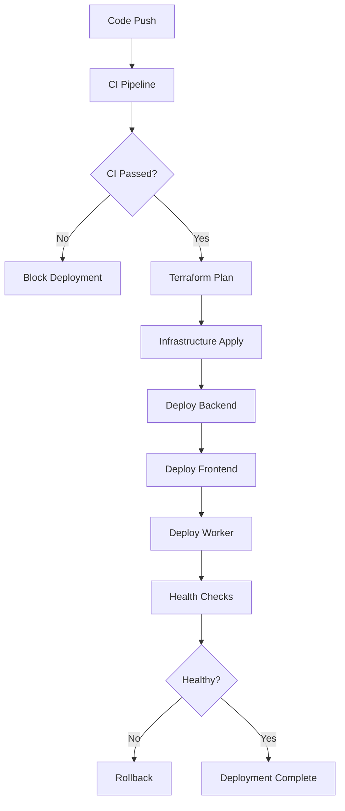

# Deployment Guide

This guide covers the complete deployment process for the Persona Job Assistant application using GitHub Actions and Terraform for Render.io deployment.

## Overview

The application uses a modern CI/CD pipeline with:
- **GitHub Actions** for continuous integration and deployment
- **Terraform** for infrastructure as code
- **Render.io** as the hosting platform
- **Multi-environment** support (staging/production)
- **Comprehensive security scanning** (see [Security Scanning Guide](./SECURITY-SCANNING.md))

## Architecture

```
┌─────────────────┐    ┌──────────────────┐    ┌─────────────────────┐
│   Frontend      │    │     Backend      │    │  Temporal Worker    │
│   (Next.js)     │───▶│    (NestJS)      │───▶│   (Background)      │
│                 │    │                  │    │                     │
└─────────────────┘    └──────────────────┘    └─────────────────────┘
         │                       │                         │
         │                       │                         │
         ▼                       ▼                         ▼
┌─────────────────────────────────────────────────────────────────────┐
│                         Render.io                                  │
├─────────────────┬──────────────────┬─────────────────────────────────┤
│   Web Service   │   Web Service    │      Background Worker          │
│   (Frontend)    │   (Backend)      │      (Temporal)                 │
└─────────────────┴──────────────────┴─────────────────────────────────┘
                           │
                           ▼
                  ┌─────────────────┐
                  │   PostgreSQL    │
                  │   Database      │
                  └─────────────────┘
```

## Prerequisites

### 1. Required Accounts
- GitHub account with repository access
- Render.io account
- AWS account (for Terraform state storage)
- Google Cloud account (for Gemini API)

### 2. Required Tools
- Terraform >= 1.6.0
- Node.js >= 18.0.0
- pnpm >= 8.x
- Git

### 3. Required Secrets
Configure these secrets in your GitHub repository settings:

| Secret Name | Description | Example |
|-------------|-------------|---------|
| `RENDER_API_KEY` | Render.io API key | `rnd_xxx...` |
| `GEMINI_API_KEY` | Google Gemini API key | `AIza...` |
| `AWS_ACCESS_KEY_ID` | AWS access key for S3 backend | `AKIA...` |
| `AWS_SECRET_ACCESS_KEY` | AWS secret key | `xxx...` |
| `TF_STATE_BUCKET` | S3 bucket for Terraform state | `my-terraform-state` |
| `TEMPORAL_ADDRESS` | Temporal server address | `temporal.example.com:7233` |

## Infrastructure Setup

### 1. Terraform State Backend

Create an S3 bucket and DynamoDB table for Terraform state:

```bash
# Create S3 bucket
aws s3 mb s3://persona-job-assistant-terraform-state

# Create DynamoDB table
aws dynamodb create-table \
  --table-name terraform-state-lock \
  --attribute-definitions AttributeName=LockID,AttributeType=S \
  --key-schema AttributeName=LockID,KeyType=HASH \
  --provisioned-throughput ReadCapacityUnits=5,WriteCapacityUnits=5
```

### 2. Environment Configuration

The infrastructure supports two environments:

#### Staging Environment
- **Branch**: `develop`
- **Auto-deploy**: Enabled
- **Resources**: Starter plans (cost-effective)
- **Domain**: `*.onrender.com`

#### Production Environment
- **Branch**: `main`
- **Auto-deploy**: Disabled (manual approval required)
- **Resources**: Pro plans (high availability)
- **Domain**: Custom domains (optional)

## Deployment Process

### 1. Manual Deployment

Use the deployment script for manual deployments:

```bash
# Make script executable
chmod +x scripts/deploy.sh

# Deploy to staging
./scripts/deploy.sh staging plan
./scripts/deploy.sh staging apply

# Deploy to production
./scripts/deploy.sh production plan
./scripts/deploy.sh production apply
```

### 2. Automated Deployment

The CI/CD pipeline automatically triggers on:

#### Continuous Integration (CI)
- **Trigger**: All pull requests and pushes
- **Actions**: 
  - Security scanning (Trivy)
  - Code quality checks (ESLint, Prettier)
  - Unit and E2E tests
  - Build validation
  - Docker security scanning

#### Continuous Deployment (CD)
- **Staging**: Automatic deployment on push to `develop`
- **Production**: Automatic deployment on push to `main`
- **Manual**: Via GitHub Actions workflow_dispatch

### 3. Deployment Workflow



## Service Configuration

### Backend Service (NestJS)
- **Runtime**: Node.js 18
- **Build Command**: `pnpm install --frozen-lockfile && pnpm run build:backend`
- **Start Command**: `cd backend && node dist/main.js`
- **Health Check**: `/api/health`

### Frontend Service (Next.js)
- **Runtime**: Node.js 18
- **Build Command**: `cd .. && pnpm install --frozen-lockfile && pnpm run build:frontend`
- **Start Command**: `cd frontend && npm start`

### Worker Service (Temporal)
- **Runtime**: Node.js 18
- **Build Command**: `pnpm install --frozen-lockfile && pnpm run build:backend`
- **Start Command**: `cd backend && node dist/worker/temporal-worker.js`

## Environment Variables

### Backend
| Variable | Description | Required |
|----------|-------------|----------|
| `NODE_ENV` | Environment mode | Yes |
| `DATABASE_URL` | PostgreSQL connection string | Yes |
| `TEMPORAL_ADDRESS` | Temporal server address | Yes |
| `GEMINI_API_KEY` | Google Gemini API key | Yes |
| `CORS_ORIGINS` | Allowed CORS origins | Yes |

### Frontend
| Variable | Description | Required |
|----------|-------------|----------|
| `NEXT_PUBLIC_API_URL` | Backend API URL | Yes |
| `NODE_ENV` | Environment mode | Yes |

## Monitoring and Health Checks

### Application Health
- **Backend**: `/api/health` endpoint
- **Frontend**: Root path health check
- **Worker**: Process monitoring

### Monitoring Features
- **Request logging**: Enabled for all services
- **Error tracking**: Centralized error reporting
- **Performance metrics**: Response time tracking
- **Security monitoring**: Failed authentication attempts

## Security Best Practices

### 1. Secrets Management
- All secrets stored in GitHub Secrets
- Environment variables encrypted in transit
- No secrets in code or logs

### 2. Network Security
- HTTPS enforced for all services
- CORS properly configured
- Security headers implemented

### 3. Access Control
- Non-root containers
- Principle of least privilege
- Regular security scanning

## Troubleshooting

For comprehensive troubleshooting information, see the [Troubleshooting Guide](./TROUBLESHOOTING.md).

### Quick Common Fixes

#### 1. PNPM Lockfile Issues
```bash
# If you see "Cannot install with frozen-lockfile" errors:
# ✅ Already fixed in CI with automatic fallback
# For local development, update pnpm version:
npm install -g pnpm@9
```

#### 2. Deployment Failures
```bash
# Check deployment logs
./scripts/deploy.sh staging output

# Validate configuration
./scripts/deploy.sh staging validate

# Re-plan deployment
./scripts/deploy.sh staging plan
```

#### 3. Health Check Failures
- Verify environment variables are set correctly
- Check service logs in Render dashboard
- Ensure database connectivity
- See [Troubleshooting Guide](./TROUBLESHOOTING.md) for detailed solutions

### Rollback Procedures

#### 1. Application Rollback
```bash
# Rollback to previous deployment
git revert <commit-hash>
git push origin main  # or develop for staging
```

#### 2. Infrastructure Rollback
```bash
# Rollback infrastructure changes
./scripts/deploy.sh production plan  # with previous configuration
./scripts/deploy.sh production apply
```

## Performance Optimization

### 1. Build Optimization
- Multi-stage Docker builds
- Dependency caching
- Build artifact reuse

### 2. Runtime Optimization
- Production-optimized configurations
- Resource limits and scaling
- CDN integration (optional)

## Cost Management

### Staging Environment
- **Services**: 3 starter instances
- **Database**: Starter PostgreSQL
- **Estimated cost**: ~$21/month

### Production Environment
- **Services**: 6 pro instances (with HA)
- **Database**: Pro PostgreSQL with backups
- **Estimated cost**: ~$175/month

## Support and Maintenance

### Regular Tasks
- [ ] Monitor deployment success rates
- [ ] Review security scan results
- [ ] Update dependencies monthly
- [ ] Backup verification
- [ ] Performance monitoring

### Emergency Contacts
- **Infrastructure**: DevOps team
- **Application**: Development team
- **Security**: Security team

For additional support, refer to:
- [Render.io Documentation](https://render.com/docs)
- [Terraform Documentation](https://terraform.io/docs)
- [GitHub Actions Documentation](https://docs.github.com/en/actions) 