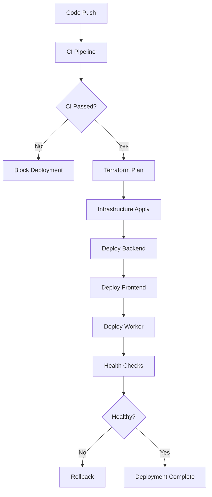

# Deployment Guide

This guide covers the complete deployment process for the Persona Job Assistant application using GitHub Actions and Terraform for Render.io deployment.

## Overview

The application uses a modern CI/CD pipeline with:
- **GitHub Actions** for continuous integration and deployment
- **Terraform** for infrastructure as code
- **Render.io** as the hosting platform
- **Multi-environment** support (staging/production)
- **Comprehensive security scanning** (see [Security Scanning Guide](./SECURITY-SCANNING.md))

## Architecture

```
┌─────────────────┐    ┌──────────────────┐    ┌─────────────────────┐
│   Frontend      │    │     Backend      │    │  Temporal Worker    │
│   (Next.js)     │───▶│    (NestJS)      │───▶│   (Background)      │
│                 │    │                  │    │                     │
└─────────────────┘    └──────────────────┘    └─────────────────────┘
         │                       │                         │
         │                       │                         │
         ▼                       ▼                         ▼
┌─────────────────────────────────────────────────────────────────────┐
│                         Render.io                                  │
├─────────────────┬──────────────────┬─────────────────────────────────┤
│   Web Service   │   Web Service    │      Background Worker          │
│   (Frontend)    │   (Backend)      │      (Temporal)                 │
└─────────────────┴──────────────────┴─────────────────────────────────┘
                           │
                           ▼
                  ┌─────────────────┐
                  │   PostgreSQL    │
                  │   Database      │
                  └─────────────────┘
```

## Prerequisites

### 1. Required Accounts
- GitHub account with repository access
- Render.io account
- Terraform Cloud account (for state management)
- Google Cloud account (for Gemini API)

### 2. Required Tools
- Terraform >= 1.6.0
- Node.js >= 18.0.0
- pnpm >= 8.x
- Git

### 3. Required Secrets
Configure these secrets in your GitHub repository settings:

| Secret Name | Description | Example |
|-------------|-------------|---------|
| `TF_API_TOKEN` | Terraform Cloud API token | `tfc_xxx...` |
| `RENDER_API_KEY` | Render.io API key | `rnd_xxx...` |
| `GEMINI_API_KEY` | Google Gemini API key | `AIza...` |
| `TEMPORAL_ADDRESS` | Temporal server address | `temporal.example.com:7233` |

## Infrastructure Setup

### 1. Terraform Cloud Setup

Create a Terraform Cloud workspace for state management:

```bash
# 1. Create account at https://cloud.hashicorp.com/products/terraform
# 2. Create organization (e.g., "rsa-task")
# 3. Create workspace named "job-assistant-production"
# 4. Generate API token: Settings → API Tokens → Create API Token

# 5. Update organization in infrastructure/main.tf if needed:
# cloud {
#   organization = "your-org-name"
#   workspaces {
#     name = "job-assistant-production"
#   }
# }
```

### 2. Environment Configuration

The infrastructure supports two environments:

#### Staging Environment
- **Branch**: `develop`
- **Auto-deploy**: Enabled
- **Resources**: Starter plans (cost-effective)
- **Domain**: `*.onrender.com`

#### Production Environment
- **Branch**: `main`
- **Auto-deploy**: Disabled (manual approval required)
- **Resources**: Pro plans (high availability)
- **Domain**: Custom domains (optional)

## Deployment Process

### 1. Manual Deployment

Use the deployment script for manual deployments:

```bash
# Make script executable
chmod +x scripts/deploy.sh

# Deploy to staging
./scripts/deploy.sh staging plan
./scripts/deploy.sh staging apply

# Deploy to production
./scripts/deploy.sh production plan
./scripts/deploy.sh production apply
```

### 2. Automated Deployment

The CI/CD pipeline automatically triggers on:

#### Continuous Integration (CI)
- **Trigger**: All pull requests and pushes
- **Actions**: 
  - Security scanning (Trivy)
  - Code quality checks (ESLint, Prettier)
  - Unit and E2E tests
  - Build validation
  - Docker security scanning

#### Continuous Deployment (CD)
- **Staging**: Automatic deployment on push to `develop`
- **Production**: Automatic deployment on push to `main`
- **Manual**: Via GitHub Actions workflow_dispatch

### 3. Deployment Workflow



## Service Configuration

### Backend Service (NestJS)
- **Runtime**: Node.js 18
- **Build Command**: `pnpm install --frozen-lockfile && pnpm run build:backend`
- **Start Command**: `cd backend && node dist/main.js`
- **Health Check**: `/api/health`

### Frontend Service (Next.js)
- **Runtime**: Node.js 18
- **Build Command**: `cd .. && pnpm install --frozen-lockfile && pnpm run build:frontend`
- **Start Command**: `cd frontend && npm start`

### Worker Service (Temporal)
- **Runtime**: Node.js 18
- **Build Command**: `pnpm install --frozen-lockfile && pnpm run build:backend`