# 🚀 Production Deployment Guide

Complete guide for deploying the Job Application Assistant to production using GitHub Actions and Terraform.

## 🏗️ Deployment Architecture

```mermaid
graph TB
    A[📝 Code Push] --> B[🔍 CI Pipeline]
    B --> C[✅ Tests & Security]
    C --> D[📋 Terraform Plan]
    D --> E{Review Plan}
    E -->|Approve| F[🚀 Deploy Infrastructure]
    E -->|Reject| G[🛑 Stop Deployment]
    F --> H[🏥 Health Checks]
    H --> I[✅ Deployment Complete]

    subgraph "🏗️ Infrastructure"
        J[🗄️ PostgreSQL]
        K[🔧 Backend API]
        L[🎨 Frontend]
        M[⚙️ Background Worker]
    end

    F --> J
    F --> K
    F --> L
    F --> M
```



## 📋 Prerequisites

### 1. Required Accounts

- GitHub account with repository access
- [Render.io](https://render.com) account
- [Terraform Cloud](https://cloud.hashicorp.com/products/terraform) account
- [Google Cloud](https://console.cloud.google.com) account (for Gemini API)

### 2. Required Tools

- Terraform >= 1.6.0
- Git
- Access to external Temporal cluster

## 🔐 Configuration

### 1. Terraform Cloud Setup

```bash
# 1. Create organization at https://cloud.hashicorp.com/products/terraform
# 2. Create workspace named "job-assistant-production"
# 3. Generate API token: Settings → API Tokens → Create API Token
```

Update your organization in `infrastructure/main.tf`:

```hcl
cloud {
  organization = "your-org-name"  # ← Change this
  workspaces {
    name = "job-assistant-production"
  }
}
```

### 2. GitHub Secrets

Add these secrets to your repository (**Settings** → **Secrets and variables** → **Actions**):

| Secret                | Description                    | Example                     |
| --------------------- | ------------------------------ | --------------------------- |
| `TF_API_TOKEN`        | Terraform Cloud API token      | `ATxxxxx...`                |
| `RENDER_API_KEY`      | Render.io API key              | `rnd_xxx...`                |
| `RENDER_OWNER_ID`     | Render.io Owner ID             | `usr_xxx...`                |
| `TEMPORAL_ADDRESS`    | External Temporal cluster      | `temporal.example.com:7233` |
| `GEMINI_API_KEY`      | Google Gemini API key          | `AIxxxxx...`                |
| `GITHUB_ACCESS_TOKEN` | GitHub token for private repos | `github_pat_xxx...`         |

## 🚀 Deployment Options

### Option 1: Automated CI/CD (Recommended)

```bash
# Push to main branch triggers the pipeline
git add .
git commit -m "Deploy to production"
git push origin main

# Monitor the pipeline at:
# https://github.com/your-org/rsa-task/actions
```

**Pipeline Steps:**

1. **🔍 CI Tests**: Run tests, linting, security scans
2. **📋 Terraform Plan**: Show infrastructure changes
3. **👤 Manual Approval**: Review and approve changes
4. **🚀 Deploy**: Apply infrastructure changes
5. **🏥 Health Checks**: Verify services are healthy

### Option 2: Manual Deployment

```bash
# 1. Set environment variables
export TF_VAR_render_api_key="rnd_xxxxxxxxxxxxx"
export TF_VAR_render_owner_id="usr_xxxxxxxxxxxxx"
export TF_VAR_gemini_api_key="AIzaxxxxxxxxxxxxxxxxx"
export TF_VAR_temporal_address="your-external-temporal:7233"
export TF_VAR_github_access_token="github_pat_xxxxxxxxxxxxx"

# 2. Deploy infrastructure
cd infrastructure
terraform init
terraform plan    # Review changes
terraform apply   # Apply changes

# 3. Get service URLs
terraform output
```

## 📊 Service Configuration

### Resource Plans

Edit `infrastructure/terraform.tfvars`:

```hcl
# Development/Testing
backend_plan  = "starter"
frontend_plan = "starter"
database_plan = "starter"

# Production
backend_plan  = "pro"
frontend_plan = "pro"
database_plan = "pro"

# Scaling
backend_instances  = 2
frontend_instances = 2
worker_instances   = 2
```

### Environment Variables

The infrastructure automatically configures:

**Backend Environment:**

- `NODE_ENV`: production
- `PORT`: 3000
- `TEMPORAL_ADDRESS`: Your external cluster
- `GEMINI_API_KEY`: From secrets
- Database connection variables

**Frontend Environment:**

- `NODE_ENV`: production
- `NEXT_PUBLIC_API_URL`: Backend service URL
- `PORT`: 3000

## 🔍 Monitoring & Health

### Health Endpoints

```bash
# Backend API health
curl https://your-backend-url/api/health

# Database connectivity
curl https://your-backend-url/api/health/db

# Temporal worker status
curl https://your-backend-url/api/health/temporal
```

### Monitoring Dashboards

- **Render Dashboard**: Service health and logs
- **Temporal UI**: Workflow execution monitoring
- **GitHub Actions**: Deployment pipeline status

## 💰 Cost Estimation

### Monthly Costs (USD)

| Service           | Starter | Pro      |
| ----------------- | ------- | -------- |
| Backend API       | $7      | $25      |
| Frontend          | $7      | $25      |
| Background Worker | $7      | $25      |
| PostgreSQL        | $7      | $25      |
| **Total**         | **$28** | **$100** |

_Note: Temporal cluster costs are separate_

## 🔄 Rollback & Recovery

### Automatic Rollback

Services automatically rollback on:

- Health check failures
- Startup errors
- Critical exceptions

### Manual Rollback

```bash
# Rollback specific service
cd infrastructure
terraform plan -destroy -target=render_web_service.backend
terraform apply

# Complete rollback
terraform destroy
```

## 🚨 Troubleshooting

### Common Issues

**1. Authentication Failures**

```bash
# Test credentials
curl -H "Authorization: Bearer $RENDER_API_KEY" \
     https://api.render.com/v1/services
```

**2. Service Won't Start**

- Check service logs in Render Dashboard
- Verify environment variables
- Check build commands and dependencies

**3. Database Connection Issues**

- Verify database credentials
- Check network connectivity
- Review connection pool settings

**4. Temporal Worker Issues**

- Verify `TEMPORAL_ADDRESS` is correct
- Check external Temporal cluster status
- Review worker logs

### Debug Commands

```bash
# Check service status
terraform show

# View service logs
# (Access through Render Dashboard)

# Test API endpoints
curl -I https://your-backend-url/api/health
```

## 📈 Scaling Guide

### Horizontal Scaling

```hcl
# In terraform.tfvars
backend_instances = 3
frontend_instances = 2
worker_instances = 2
```

### Vertical Scaling

```hcl
# Upgrade to higher performance plans
backend_plan = "pro-plus"
frontend_plan = "pro"
database_plan = "pro"
```

## 🔒 Security Best Practices

- 🔐 **Secrets Management**: Use GitHub Secrets for sensitive data
- 🛡️ **Environment Isolation**: Separate staging and production
- 📝 **Audit Logging**: Monitor all deployment activities
- 🔍 **Security Scanning**: Automated vulnerability detection
- 🔒 **Access Control**: Limit who can approve deployments

---

**Next Steps:**

- Review the [Troubleshooting Guide](TROUBLESHOOTING.md)
- Check [Security Policy](../SECURITY.md)
- Monitor your deployed services
