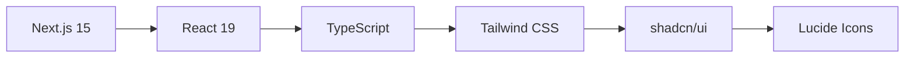

# Frontend Application

Modern Next.js frontend for the Job Application Assistant with AI-powered features and responsive design.

## 🚀 Quick Start

```bash
# Install dependencies
pnpm install

# Start development server
pnpm dev

# Open in browser
open http://localhost:3000
```

## ✨ Features

| Feature                  | Description                               |
| ------------------------ | ----------------------------------------- |
| 📱 **Responsive Design** | Mobile-first UI that works on all devices |
| 🎨 **Modern UI**         | Built with shadcn/ui components           |
| 📊 **Dashboard**         | Overview of all job applications          |
| 🔄 **Real-time Updates** | Live status synchronization               |
| 🎯 **Smart Filtering**   | Filter applications by status             |
| 📅 **Deadline Tracking** | Visual indicators for due dates           |

## 🛠️ Tech Stack



## 📁 Project Structure

```
frontend/
├── src/
│   ├── app/                 # Next.js app router
│   │   ├── page.tsx         # Dashboard page
│   │   ├── layout.tsx       # App layout
│   │   └── globals.css      # Global styles
│   ├── components/
│   │   ├── ui/              # Reusable UI components
│   │   ├── application-card.tsx
│   │   └── application-form.tsx
│   └── lib/
│       ├── types.ts         # TypeScript definitions
│       ├── api.ts           # API client
│       └── utils.ts         # Utility functions
├── public/                  # Static assets
└── package.json
```

## 🔧 Configuration

### Environment Variables

Create `.env.local` (optional):

```env
NEXT_PUBLIC_API_URL=http://localhost:3001/api
```

### Default Settings

- **API URL**: `http://localhost:3001/api`
- **Port**: 3000
- **Build Output**: `.next/`

## 🎨 UI Components

### Application Management

```typescript
// Add new application
const handleCreate = async (data: ApplicationData) => {
  await api.createApplication(data);
  // Refresh list
};

// Update application status
const handleStatusUpdate = async (id: string, status: ApplicationStatus) => {
  await api.updateApplication(id, { status });
};
```

### Status Types

| Status        | Color  | Description                  |
| ------------- | ------ | ---------------------------- |
| **Pending**   | Blue   | Initial application status   |
| **Interview** | Yellow | Interview scheduled          |
| **Offer**     | Green  | Job offer received           |
| **Rejected**  | Red    | Application rejected         |
| **Withdrawn** | Gray   | Withdrawn from process       |
| **Archived**  | Gray   | Auto-archived after deadline |

## 🔄 API Integration

### Endpoints Used

| Method   | Endpoint                | Purpose                |
| -------- | ----------------------- | ---------------------- |
| `GET`    | `/api/applications`     | Fetch all applications |
| `POST`   | `/api/applications`     | Create new application |
| `PATCH`  | `/api/applications/:id` | Update application     |
| `DELETE` | `/api/applications/:id` | Delete application     |

### Error Handling

```typescript
try {
  const response = await api.getApplications();
  setApplications(response.data);
} catch (error) {
  console.error('Failed to fetch applications:', error);
  // Show user-friendly error message
}
```

## 🎯 User Experience

### Visual Indicators

- **🔴 Overdue**: Red text for past deadlines
- **🟡 Due Soon**: Yellow badge for <7 days
- **🟢 Cover Letter**: Green checkmark when generated
- **📅 Deadline**: Days remaining counter

### Responsive Breakpoints

```css
/* Mobile: < 768px */
/* Tablet: 768px - 1024px */
/* Desktop: > 1024px */
```

## 🧪 Development

### Available Scripts

| Command           | Description              |
| ----------------- | ------------------------ |
| `pnpm dev`        | Start development server |
| `pnpm build`      | Build for production     |
| `pnpm start`      | Start production server  |
| `pnpm lint`       | Run ESLint               |
| `pnpm type-check` | Run TypeScript check     |

### Code Quality

- **ESLint**: Code linting and formatting
- **TypeScript**: Type safety
- **Prettier**: Code formatting
- **Tailwind**: Utility-first CSS

## 📱 Mobile Experience

### Touch-Friendly Design

- Large tap targets (min 44px)
- Swipe gestures for actions
- Optimized form inputs
- Fast tap responses

### Performance

- **Bundle Size**: Optimized with tree-shaking
- **Images**: Next.js automatic optimization
- **Fonts**: Optimized loading with `next/font`
- **Code Splitting**: Automatic route-based splitting

## 🔍 Troubleshooting

### Common Issues

**1. API Connection Error**

```bash
# Check if backend is running
curl http://localhost:3001/api/health

# Verify CORS settings
# Check browser console for CORS errors
```

**2. Build Errors**

```bash
# Clear cache
rm -rf .next
pnpm build

# Check TypeScript errors
pnpm type-check
```

**3. Styling Issues**

```bash
# Clear Tailwind cache
rm -rf .next
pnpm dev
```

### Debug Mode

```bash
# Enable debug logging
DEBUG=* pnpm dev

# Check build analyzer
pnpm build:analyze
```

## 🚀 Deployment

### Production Build

```bash
# Build for production
pnpm build

# Test production build locally
pnpm start
```

### Environment Variables

Production requires:

- `NEXT_PUBLIC_API_URL`: Backend API URL
- `NODE_ENV`: "production"

## 📚 References

- [Next.js Documentation](https://nextjs.org/docs)
- [React 19 Features](https://react.dev/blog/2024/04/25/react-19)
- [Tailwind CSS](https://tailwindcss.com/docs)
- [shadcn/ui Components](https://ui.shadcn.com/)

---

**Development Tips:**

- Use TypeScript for type safety
- Follow the existing component patterns
- Test responsive design on multiple devices
- Keep components small and focused
